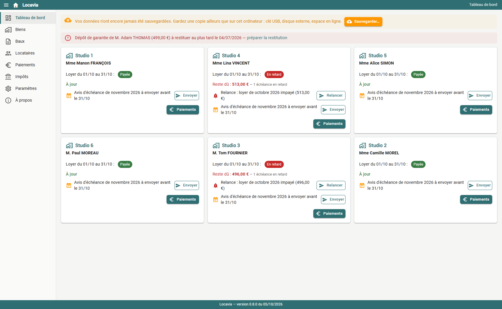
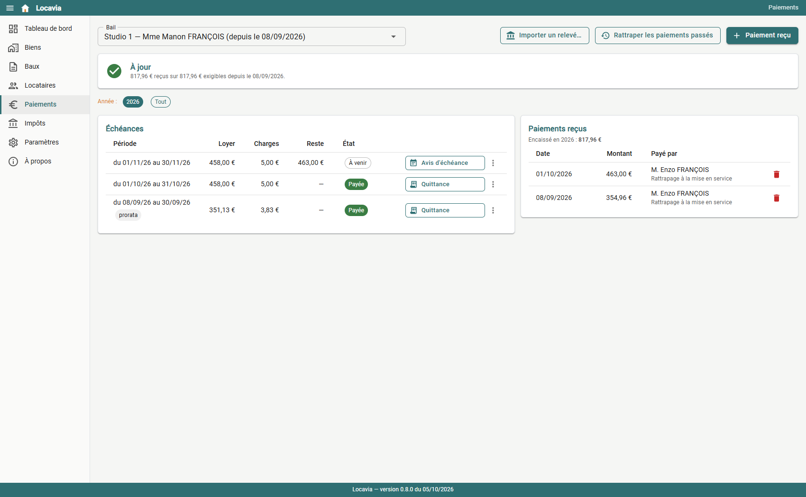
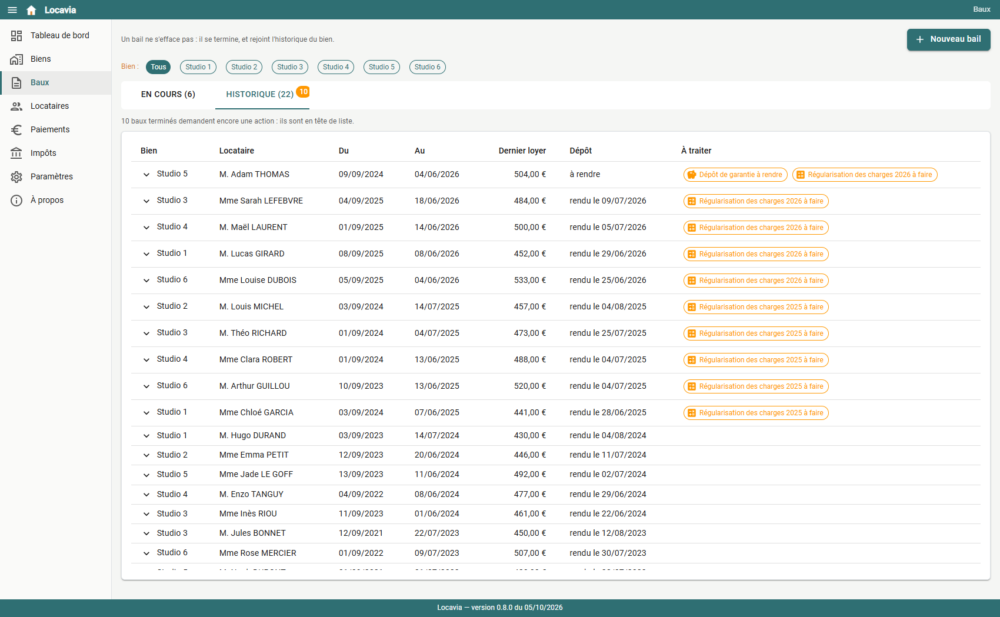
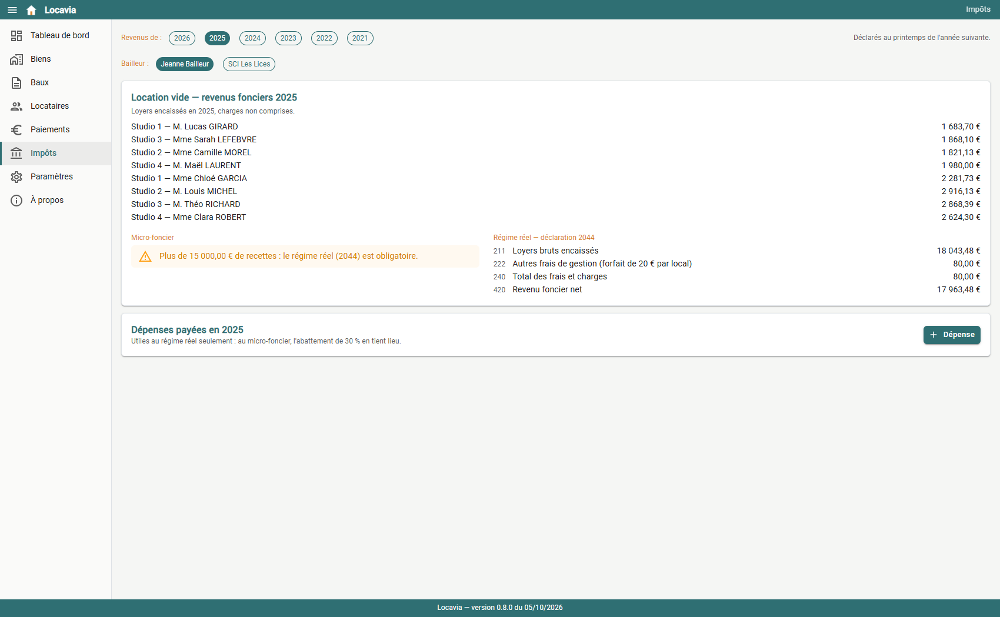

# Locavia

**Locavia — Gestion locative gratuite pour propriétaires particuliers**

🏠 Windows & Linux · 🇫🇷 Réglementation française · 🔒 Données locales · 🆓 Gratuit · Aucun abonnement · Aucun cloud

Locavia est un logiciel de bureau gratuit pour gérer soi-même ses locations immobilières : biens, locataires, baux, loyers, quittances, relances, états des lieux, charges, dépôt de garantie et déclaration des revenus.

Aucun compte à créer. Aucune donnée stockée en ligne.

**Gestion locative pour particulier.** Loyers, quittances, relances, révision IRL, régularisation des charges, états des lieux, dépôt de garantie et déclaration de revenus, sans abonnement ni cloud.

Locavia est une application de bureau gratuite pour **Windows et Linux**. Vos données restent sur votre ordinateur.

## Pour qui

Le propriétaire qui loue lui-même un ou quelques logements, vides ou meublés, souvent à des étudiants avec un garant : en nom propre, en couple ou par une SCI familiale.

## Ce que fait Locavia

- **Les loyers** : échéances au prorata à l'entrée et à la sortie, paiements imputés sur la plus ancienne échéance, quittance au centime près, sinon un reçu.
- **Le tableau de bord** : qui a payé, les relances à faire, l'avis d'échéance du mois prochain, chaque envoi à un clic.
- **Le relevé bancaire** : import OFX, rapprochement automatique des virements avec les baux (nom du locataire ou du garant, montant).
- **Les courriers**, en PDF, envoyés par votre propre messagerie :
  - quittance, reçu, avis d'échéance, relance ;
  - lettre de révision du loyer selon l'IRL (indices récupérés auprès de l'Insee) ;
  - décompte de régularisation des charges ;
  - décompte de restitution du dépôt de garantie, avec ses délais légaux.
- **L'état des lieux** d'entrée et de sortie, comparés pièce par pièce. Celui d'entrée d'un nouveau bail reprend la description du précédent.
- **Les impôts** : la case 4BE du micro-foncier, les lignes de la 2044 au régime réel, la case 5ND du micro-BIC en meublé.
- **La sauvegarde** : une archive avec la base et tous les documents, et une restauration qui garde toujours de quoi revenir en arrière.

## Télécharger

Dans les [Releases](https://github.com/krissam44/locavia-app/releases) :
- **Windows** : `Installer-Locavia-<version>.exe`, sans droits d'administrateur. Le runtime WebView2 est déjà présent sous Windows 11.
- **Linux** (Ubuntu 24.04+, Debian 13+, Zorin OS 18+) : `Locavia-linux-x64.tar.gz`, à extraire, puis `bash installer.sh` dans le dossier extrait.

Locavia vous signale lui-même les nouvelles versions. Il demande seulement à GitHub le numéro de la dernière, au plus une fois par jour, et cela se désactive dans « À propos ».

## Faire un retour

Un problème, une idée d'amélioration ?

- **Depuis Locavia** : « À propos », puis « Faire un retour ». Le mail est prêt, avec la version et le système déjà indiqués.
- **Par mail**, à [locavia@sammut.fr](mailto:locavia@sammut.fr).
- **Sur GitHub**, si vous y avez un compte : dans les [demandes](https://github.com/krissam44/locavia-app/issues), choisissez « Signaler un problème » ou « Proposer une évolution ». Vous y voyez aussi ce qui est déjà demandé.

Vos messages servent uniquement à corriger et à améliorer Locavia.

## Vos données

Elles restent sur votre ordinateur, sans compte, sans abonnement et sans serveur. Rien ne part ailleurs que les mails que vous envoyez. Pensez à la sauvegarde, sur un support distinct.

## Ce que Locavia ne fait pas

La LMNP au réel (amortissements, liasse fiscale), les SCI à l'impôt sur les sociétés et la location saisonnière relèvent d'un comptable ou d'autres outils.

## Avertissement

Locavia intègre les règles et modèles applicables aux locations concernées par la réglementation française. Les informations réglementaires et fiscales sont susceptibles d'évoluer. Locavia ne constitue ni un conseil juridique ni un conseil fiscal ; il appartient à l'utilisateur de vérifier les dispositions applicables à sa situation.
